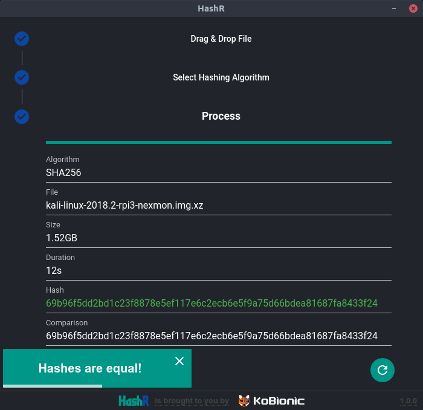

<p align="center"></p>

#

An easy to use file hashing utility working with multiple algorithms. Powered by [React](https://reactjs.org/) & [Material UI](https://material-ui.com/), built as a cross-plaform desktop application using [Electron](https://electronjs.org/).

---

## Usage

After starting the application, drag & drop your target file to window's central area. File information will automatically be filled up.

The ```Compare to``` field is optional. On below screenshot it corresponds to a digest given by the file provider used to check file integrity.

<p align="center"></p>

Then, click on the **arrow down button** to go to next screen that allows hashing algorithm selection.

<p align="center"></p>

Repeat previous click to go to the process screen. On success, generated digest will appear in the ```Hash``` field.

A comparison will be done only if the ```Compare to``` field was filled in during first step.

<p align="center"></p>

Finally, clicking on button will then go back to first step.

## Authors

* [**Jeremie Rodriguez**](https://github.com/jeremiergz) &lt;[contact@jeremierodriguez.com](mailto:contact@jeremierodriguez.com)&gt; - Main developer

## License

This project is licensed under the Apache License 2.0 - see the [LICENSE](LICENSE) file for details.

---

[<p align="center"></p>](https://github.com/KoBionic/)
